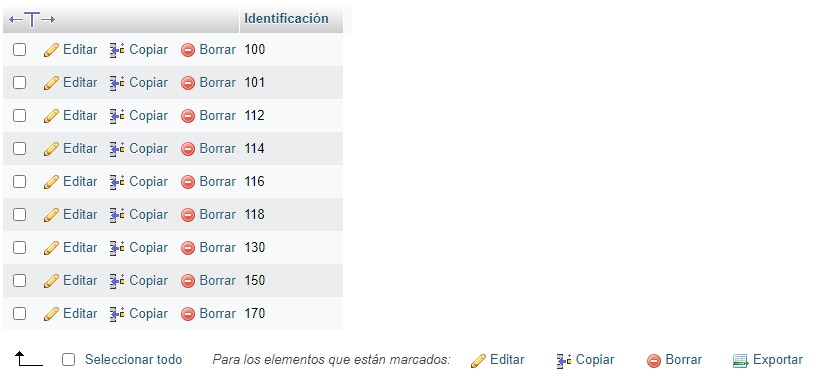
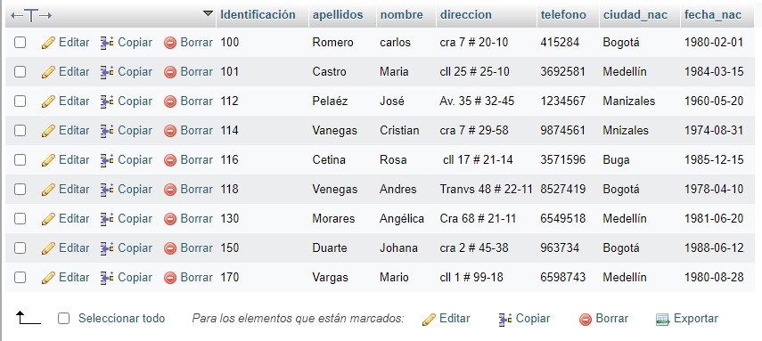
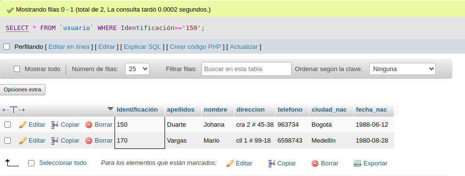
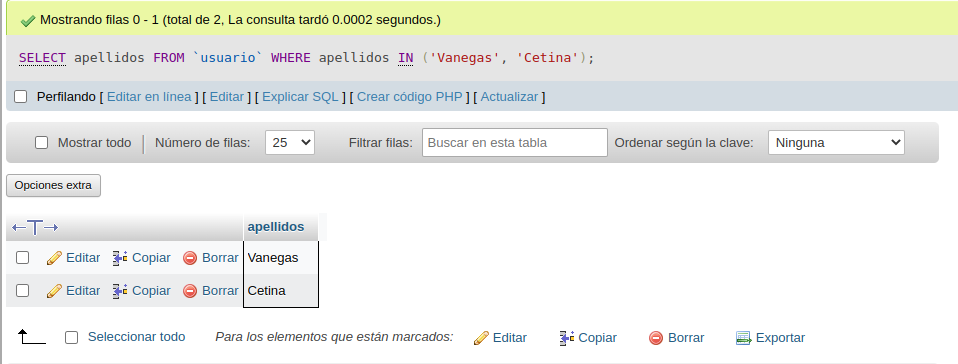
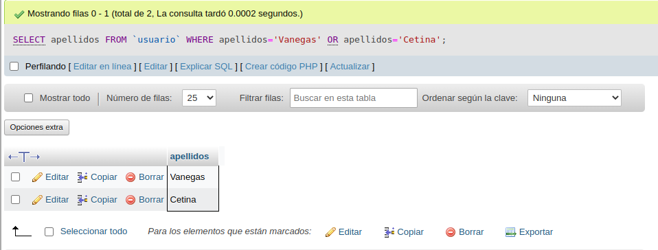
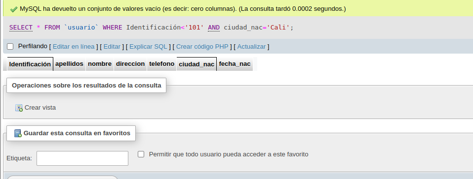
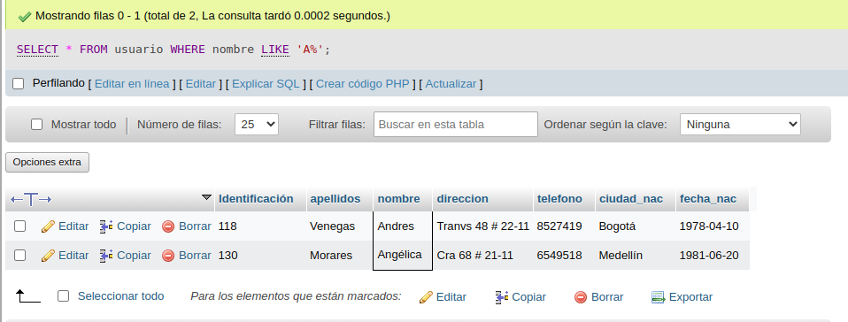

# Consulta #1 Sql

## CONSULTAS SQL

1. Para visualizar toda la información que contiene la tabla `usuario` se puede incluir con la instrucción SELECT el caracter `*` o cada una de los campos de la tabla 

- `SELECT * FROM usuario`

2. Seleccionar o visualizar solamente la identificación del usuario.

- `SELECT Identificación FROM usuario`

3. Se desea obtener los registros uya identificacion sean mayores 0 iguales a 150, se debe utilizar la clausula WHERE que especifica las condiciones que deben reunir los registros que se van a seleccionar

`SELECT * FROM usuario WHERE identificacion>='150'`

4. si se desea obtener los registros cuyo susu apelllidos sean vanegas  o cetina, se utiliza el operador IN que especifica los registros que se quieren visualizar de una tabla

`SELECT apellidos FROM usuario WHERE apellidos IN ('Vanegas','Cetina')`

o se puede uilizar el operador OR.

`SELECT apellidos FROM usuario WHERE apellidos='Vanegas' OR apellidos='Cetina'`

5. si se desea obtener los registros cuya identificacion sea menor de '110' y la ciudad sea 'Cali', se debe utilizar el operador AND.

`SELECT * FROM usuario WHERE Identificacion<'110' AND ciudad_nac='Cali'`

6. si se desea obtener los registros cuyos nokbres empiecen por la letrea 'A', se debe utilizar el operador LIKE que utiliza los patrones '%' (todos)  '_' (caracter).

`SELECT * FROM usuario WHERE nombre LIKE 'A%'`

